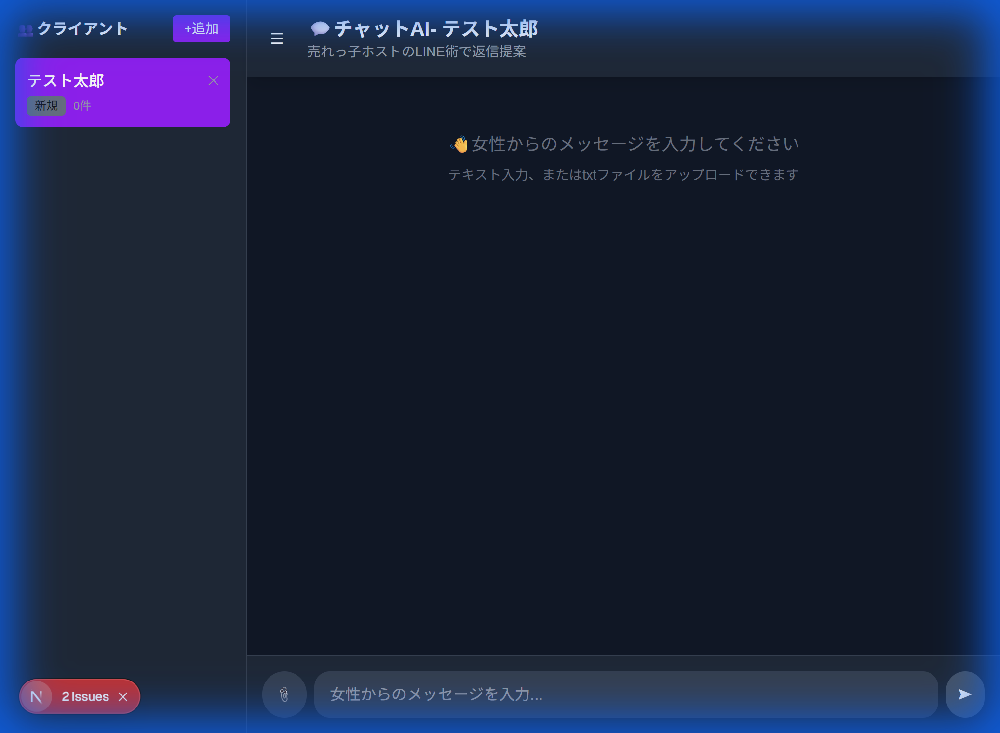

# 💬 チャットAI - ウォークスルー

> 売れっ子ホストのLINE術を活用したAI返信提案システム

---

## 📸 完成画面

### メイン画面（クライアント管理付き）


---

## ✅ 実装済み機能

| 機能 | 状態 |
|:-----|:----:|
| LINEライクなチャットUI | ✅ |
| テキスト入力 | ✅ |
| txtファイルアップロード | ✅ |
| Gemini API連携 | ✅ |
| 学習データ自動読み込み | ✅ |
| 返信候補3つ生成 | ✅ |
| ワンクリックコピー | ✅ |
| クライアント一覧（サイドバー） | ✅ |
| 会話履歴保持（localStorage） | ✅ |

---

## 🚀 セットアップ

### Step 1: API Key設定

```powershell
cd "AIチャット\app"
copy env.example .env.local
```

> [!IMPORTANT]
> `.env.local` を開いて `your_api_key_here` を実際のGemini API Keyに置き換えてください

### Step 2: 学習データ配置

`app/data/learning/` フォルダに売れっ子ホストのLINE術txtファイルを配置

### Step 3: サーバー起動

```powershell
npm run dev
```

ブラウザで http://localhost:3000 を開く

---

## 📖 使い方

| 操作 | 方法 |
|:-----|:-----|
| クライアント追加 | サイドバーの「+ 追加」ボタン |
| クライアント切替 | サイドバーで名前をクリック |
| メッセージ入力 | テキストボックスに入力 |
| ファイル読込 | 📎ボタンでtxtアップロード |
| 送信 | ➤ボタン または Enterキー |
| 返信選択 | 候補カードをクリックまたはコピー |

---

## 📁 ファイル構成

```
AIチャット/
├── 📄 開発仕様書.md
├── 📂 docs/
│   ├── walkthrough.md
│   └── screenshot_client.png
└── 📂 app/
    ├── 📂 src/app/
    │   ├── page.tsx           # チャットUI
    │   └── api/chat/route.ts  # Gemini API
    ├── 📂 data/learning/      # 学習データ
    └── env.example            # API Key設定
```

---

*最終更新: 2026-01-05*
