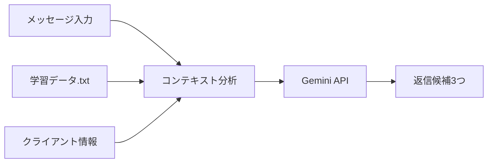

# 💬 チャットAIアプリケーション開発仕様書

> 売れっ子ホストのLINE術を学習した、AIによる返信提案システム

---

## 1. プロジェクト概要

Geminiの「Gem」機能で運用中の返信提案システムを、独立したアプリケーションにアップグレード。

**目標:**
- 専用チャットUI（LINEライク）
- クライアント情報を活用した返信生成
- txtファイルで学習データを管理

---

## 2. コア機能

### 2.1 返信候補生成



### 2.2 学習データ管理

- `app/data/learning/` フォルダにtxtファイルを配置
- 起動時に自動読み込み
- 複数ファイル対応可

### 2.3 クライアント管理

- 名前、関係性（新規/常連/VIP）、メモを管理
- 会話履歴の保持（localStorage）
- サイドバーで一覧表示・切替

---

## 3. 技術スタック

| レイヤー | 技術 |
|:---------|:-----|
| フロントエンド | Next.js 16 + TypeScript |
| スタイリング | TailwindCSS |
| AIエンジン | Gemini API |
| データ保存 | localStorage |

---

## 4. ディレクトリ構成

```
AIチャット/
├── 📄 開発仕様書.md
├── 📂 docs/
│   ├── walkthrough.md
│   └── screenshot_client.png
└── 📂 app/                      # Next.jsプロジェクト
    ├── 📂 src/app/
    │   ├── page.tsx             # メインUI
    │   ├── layout.tsx
    │   ├── globals.css
    │   └── 📂 api/chat/
    │       └── route.ts         # Gemini API連携
    ├── 📂 data/learning/        # 学習データ
    │   └── ホストLINE術.txt
    └── env.example              # API Key設定例
```

---

## 5. 開発フェーズ

- [x] Phase 1: Next.js初期化・基本レイアウト
- [x] Phase 2: チャットUI・Gemini API連携
- [x] Phase 3: txtファイル読み込み・返信生成
- [x] Phase 4: クライアント管理・会話履歴保持

---

## 6. セットアップ

```powershell
cd "AIチャット\app"
copy env.example .env.local      # API Key設定
npm run dev                      # サーバー起動
```

http://localhost:3000 で起動

---

*最終更新: 2026-01-05（実装完了）*
